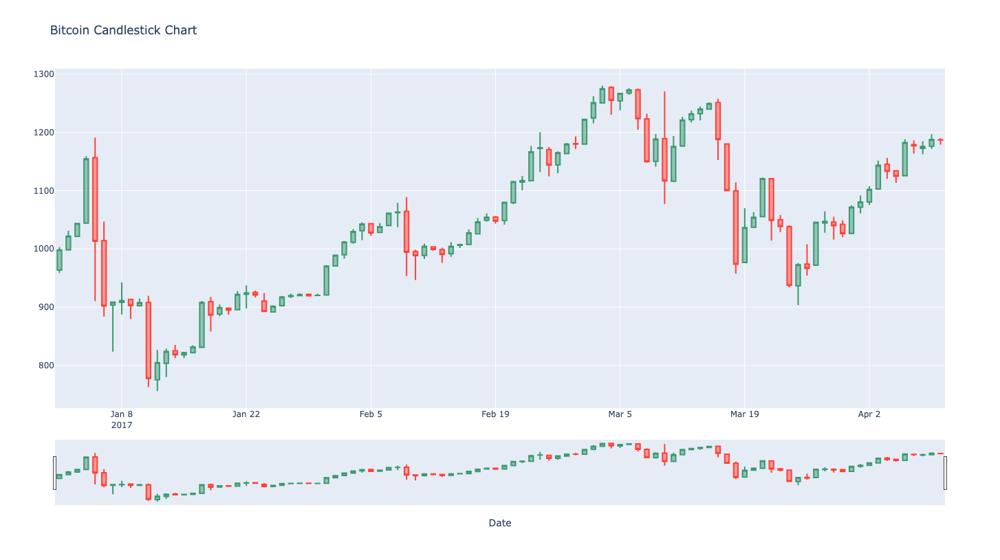
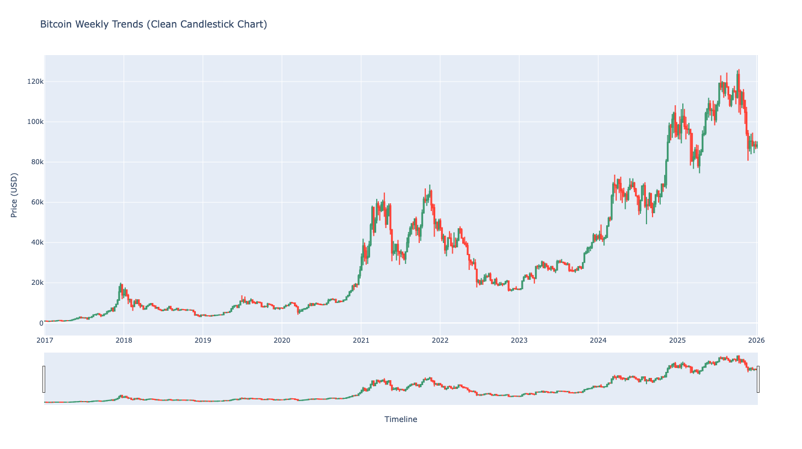
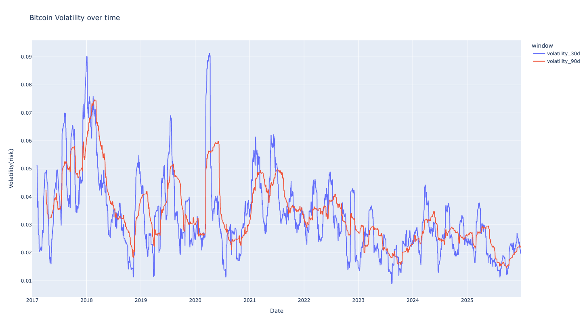
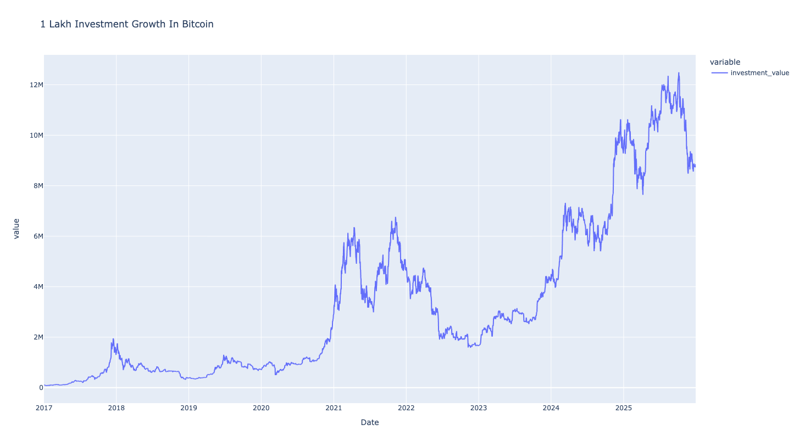
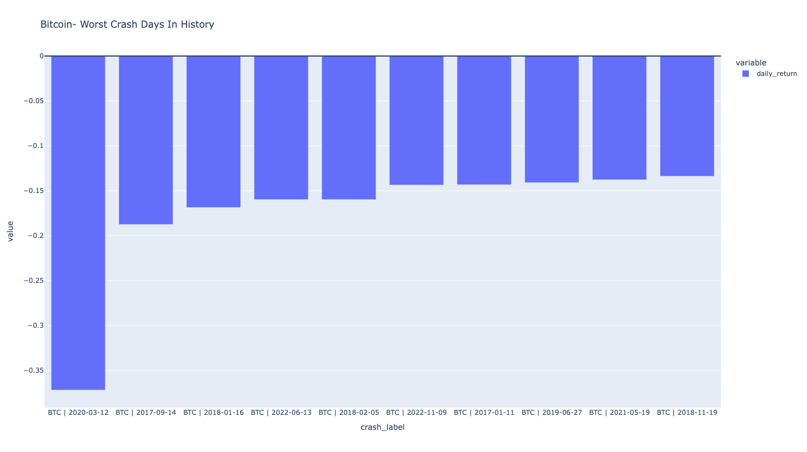
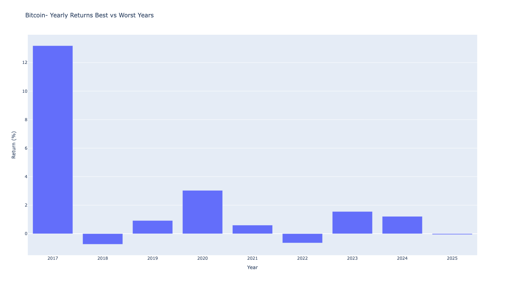

# Bitcoin (BTC-USD) Historical Time-Series Analysis & Financial Modeling

An end-to-end data analysis pipeline built in Python to analyze historical Bitcoin trends, trading volumes, investment returns, and market risk. This project ingests daily financial market data, cleans temporal records, calculates advanced rolling risk metrics, and plots interactive financial market trends.

---

## 🛠️ Tech Stack & Libraries
* **Programming Language:** Python
* **Data Sourcing:** `yfinance` (Yahoo Finance API)
* **Data Manipulation:** Pandas, NumPy
* **Data Visualization:** Plotly Express, Plotly Graph Objects
* **Development Environment:** PyCharm IDE, Git, GitHub

---

## 🧹 Data Acquisition & Preprocessing Pipeline
* **Live Ingestion:** Downloaded historical daily (`1d` interval) asset data for `BTC-USD` ranging from **January 1, 2017, to December 31, 2025**.
* **Data Integrity Checks:** Evaluated structural types, verified dates, and systematically dropped all null/missing data records.
* **Deduplication:** Audited data indices to confirm zero duplicated market timestamps, establishing a high-integrity asset time-series.

---

## 📊 Core Analysis Stages & Strategic Insights

### 1. Macro & Micro Candlestick Modeling
* **Micro Trend Analysis:** Constructed a localized candlestick pattern chart focusing on the baseline performance of the first 100 days of 2017 to capture initial asset momentum.
* **Macro Trend Resampling:** Aggregated daily trade variables into custom weekly frames. This isolates clean macro high-low price envelopes while eliminating daily charting noise across multiple years.

### 2. Volatility & Risk Quantification
* Calculated daily percentage price returns using closing market values.
* Engineered 30-day and 90-day rolling standard deviations (`.rolling().std()`) to visualize market risk windows and price volatility shifts over time.

### 3. Investment Backtesting ($100k Portfolio Growth)
* Simulated the compounding historical growth of an initial **$100,000 investment** injected into Bitcoin at the start of the timeline.
* Tracked continuous price movements to demonstrate capital compounding and portfolio valuation swings over the multi-year cycle.

### 4. Extreme Market Event Detection (Historical Crashes)
* Evaluated single-day historical drawdowns to identify the single worst asset crash days in Bitcoin's recorded trading history.
* Isolated extreme market capitulation thresholds and volume panics.

### 5. Algorithmic Trade Volume Classification
* Engineered a custom algorithmic Python function (`classify_volume_price`) to systematically evaluate price action behavior alongside volume spikes.
* Classified trading sequences into clear, actionable sentiment flags (e.g., "Strong Buying", "Strong Selling", "Normal Consolidation").

### 6. Yearly Return Profiles (Best vs. Worst Years)
* Resampled continuous daily yields into dedicated annualized returns.
* Structured comparative summaries to isolate the highest-performing bull market years against the most severe bear market contractions.

---

## 📈 Portfolio Visualizations

###  1. Initial 100-Day Performance (Bitcoin Candlestick Chart)

### 2. Historical Macro Trends (Weekly Resampled Bitcoin Candlestick Chart)

### 3. Rolling Volatility Analysis (30-day vs. 90-day Line Plot)

### 4. Portfolio Growth ($100,000 Investment Track)

### 5. Worst Market Crash Days in History (Bar Plot)

### 6. Annual Return Comparison (Best vs. Worst Calendar Years)

---

## 🚀 Key Financial Takeaways
* **Volatility Smoothing:** The 90-day volatility line isolates structural market regime changes, whereas the 30-day index flags near-term trade opportunities.
* **Volume Signatures:** The volume classification function systematically proves that extreme historical price dips occur on massive institutional sell volumes.
* **Long-Term Compound Yield:** Despite extreme drawdowns and historical single-day crashes, long-term backtesting validates significant asymmetric compounding returns over the 2017–2025 timeline.
